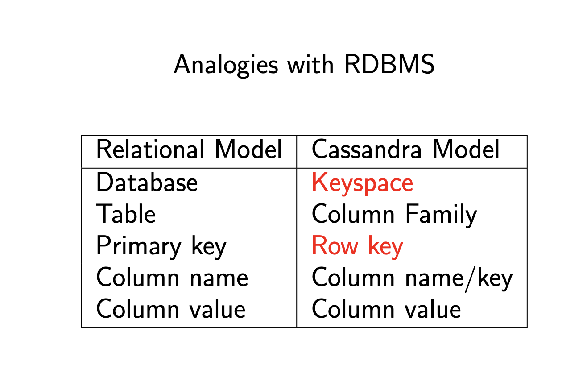
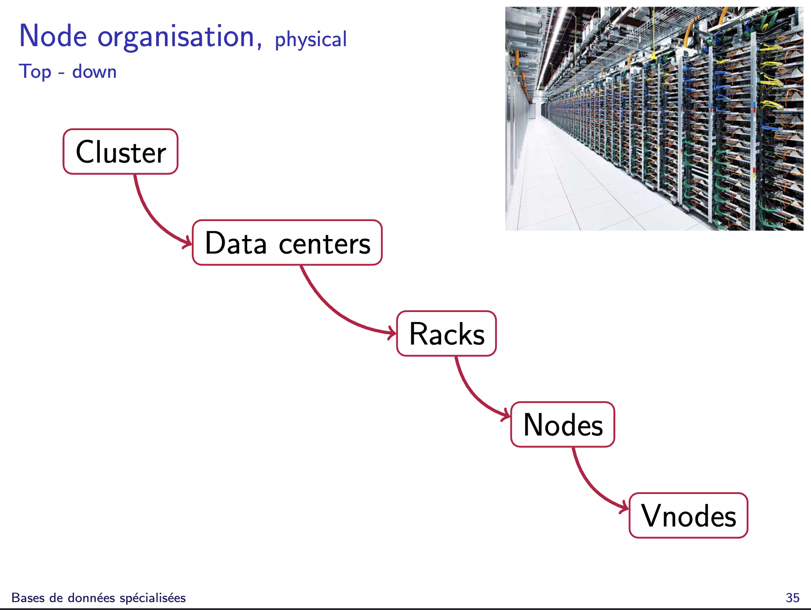
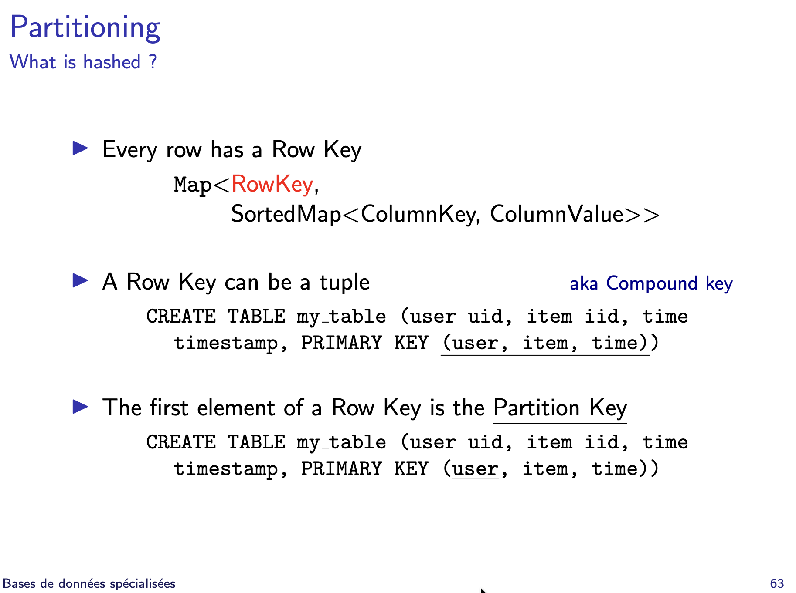
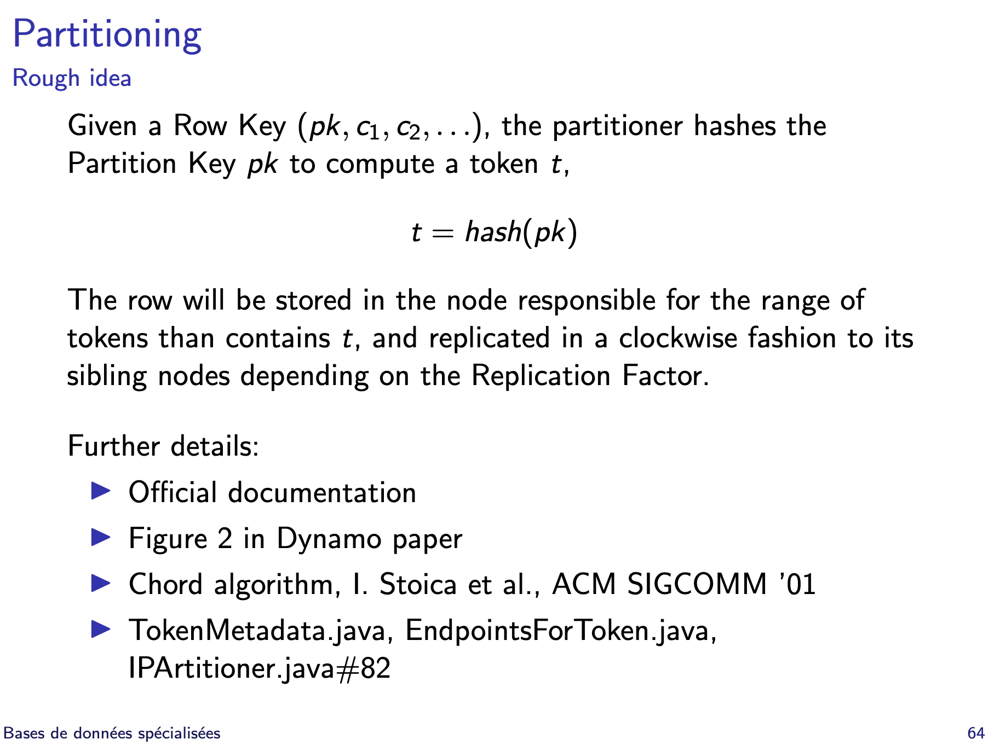
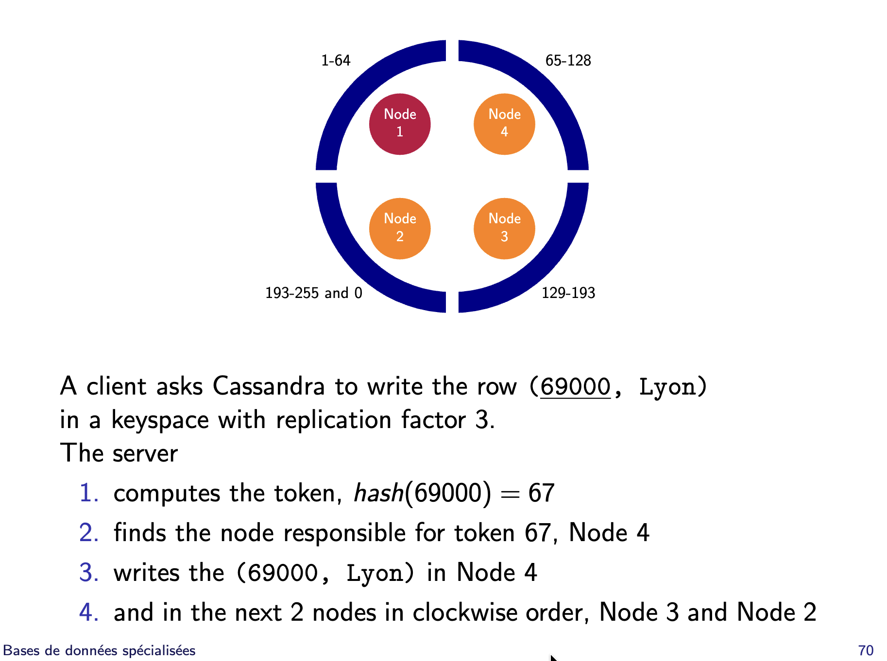

# Partie 3 - Weak consistency and Cassandra

## Cassandra Server

Donc si je comprends bien.

Un cluster contient la définition de toutes les bases de données.

Un cluster contient plusieurs datacenters. Chaque DC est un anneau (Ring) sur lequel se trouve les noeuds qui stockent les données.
On définit un replication_factor par DC.

Question 0 : Est-ce que chaque DC contient toutes les bases de données du cluster ? Ou chaque DC contient une partie des bases de données du cluster ? Ou ... ?

Chaque noeud est responsable d'une range de tokens.
Chaque noeud contient plusieurs virtual nodes (vnodes). Chaque vnode est responsable d'une range de tokens.

Question 1 : Les vnodes sont responsables d'une range de tokens inclus dans la range de tokens du noeud qui les contient ? Ou pas ?

Le replication factor est le nombre de copies des données dans un DC.
Question 2 : Le replication factor est-il le nombre de copies d'une row ou ... ?

Une keyspace est une base de données. Elle est définie par une stratégie de réplication (SimpleStrategy, NetworkTopologyStrategy).

Question 3 : Où sont stockées les keyspaces ? Dans un DC ? Ou plusieurs ? Ou ... ?

Etant donné que dans Cassandra, les row d'une même table peuvent avoir un nombre différent de colonnes, comment se passe le stockage ? Comment est définie la clé primaire ?

Ce que j'ai compris :

Une column family est une table dans une base de données.
Une table est un ensemble de rows.
Chaque row est identifiée par une row key et un ensemble de colonnes (ColumnKey, ColumnValue).
Question 4 : La RowKey est-elle l'équivalent de la clé primaire, mais pour une row ? Ou un identifiant unique pour une row ?  
La RowKey peut être un tuple de plusieurs colonnes, ce qui permet de définir une clé primaire composée.
Le premier élément de la RowKey est le partition key, qui permet de générer un token qui va permettre de déterminer le noeud responsable du stockage de la row.

Une partition est répliquée sur plusieurs vnodes.

Question 5 : Qu'est-ce qu'une partition exactement ? Est-ce la row qui est stockée sur un noeud ? Ou un ensemble de rows ? Ou ... ?

Lors de l'insertion d'une row, on copie la partition sur plusieurs vnodes, en fonction du replication factor.
Chaque copie de la partition est appelée replica.

Question 6 : Est-ce que chaque replica est stockée sur un node différent ? Ou est-ce que plusieurs replicas peuvent être stockées sur différent vnode d'un même noeud ?

Comment se passe la lecture d'une donnée ?

En conclusion, j'ai encore du mal à bien comprendre comment sont stockées et structurées les données.
